# K8s basics

### Pre-requisites:
0. Install [Rancher Desktop](https://docs.rancherdesktop.io/).
1. Build executable jar-files for all projects (gradle-modules):
  - **eureka** - this service will not be needed for K8s experiments;
  - **songs-service**;  
  - **resource-service**;  

In order to do this, being in the project's root folder run command in the Terminal:  
```
.\gradlew bootJar 
```
Locations of respective bootable jars:
  - **eureka** - eureka/build/libs/eureka-1.0-SNAPSHOT.jar;
  - **songs-service** - songs-service/build/libs/songs-service-1.0-SNAPSHOT.jar;
  - **resource-service** - resource-service/build/libs/resources-service-1.0-SNAPSHOT.jar;

3. Build Docker images from respective Dockerfiles:
  - **songs-service** ```docker build -t experimentalmicroservice-1-songs-ms:1.0 .```
  - **resource-service** ```docker build -t experimentalmicroservice-1-resources-ms:1.0 .```  
*NB: The final ```.``` in the command provides the path or URL to the build context.  
At this location, the builder will find the Dockerfile and other referenced files.*  
Refer to: 
[Docker:build-tag-and-publish-an-image](https://docs.docker.com/get-started/docker-concepts/building-images/build-tag-and-publish-an-image/).  

When docker-image is built it is stored in the local image registry supplied by [Docker Moby](https://github.com/moby/moby),  
that is a part of [Rancher Desktop](https://docs.rancherdesktop.io/#container-management):  
Components include container build tools, a **container registry**, orchestration tools, a runtime and more,  
and these can be used as building blocks in conjunction with other tools and projects.  
This is a crucial because kubernetes requires docker-images for all components, it deploys in a cluster,  
that without **local image-registry** have to be pushed into the remote Docker Hub or another image-registry system, e.g. AWS ERC.

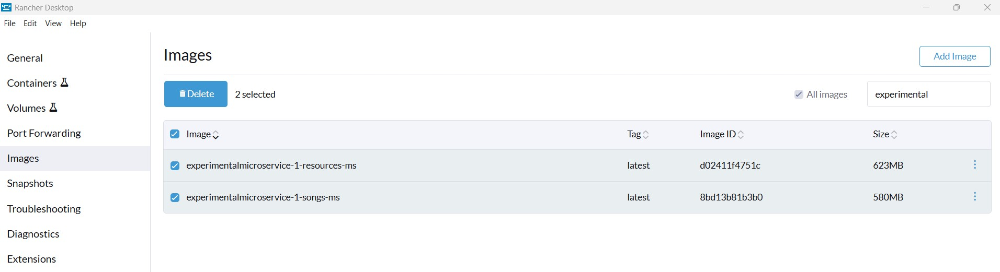

4. **K8s tasks** 
  4a. **Sub-task 1: Install k8s.**  
   The completion of this task is obvious.  

  4b. **Sub-task 2: Deploy containers in k8s.  
   The required k8s component deployment configuration located in the ```k8s/simple/deployment``` folder.  
   It contains following artefacts:
   - configuration of **Namespace**s for databases and microservices.  
   - database **Deployment** configuration as a normal Pod + respective **ConfigMap** and **Secret**,
   - microservice **Deployment** configuration as a Pod + respective **ConfigMap** and **Secret**. 
   Here **ConfigMap** and **Secret** are created per a **namespace**.
The deployment results are represented on the screenshots below:
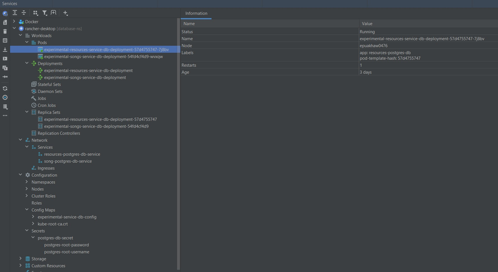  
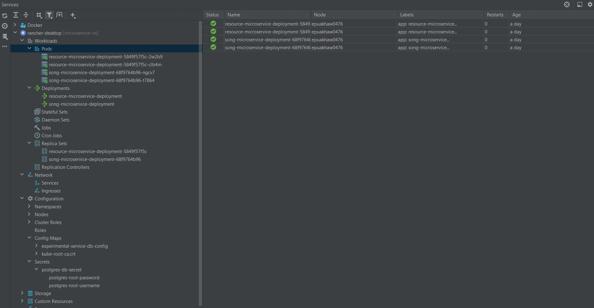.

  4c. **Sub-task 3: Persistent volumes**.
  The required k8s component deployment configuration located in the ```k8s/persistantvolume``` folder.  
  It contains following artefacts:
  - configuration of **Namespace**s for databases and microservices.
  - database **Deployment** configuration as a normal Pod + respective **ConfigMap** and **Secret**,
  - microservice **Deployment** configuration as a Pod + respective **ConfigMap** and **Secret**,
  - configuration for local (worker-node's) **PersistentVolume** that has to store files for **song-microservice**  
  independently of its pod, that could fail/shutdown and restarted by its replica-set.
  Here **ConfigMap** and **Secret** are created per a **namespace**.
The deployment results are represented on screenshots below:
  
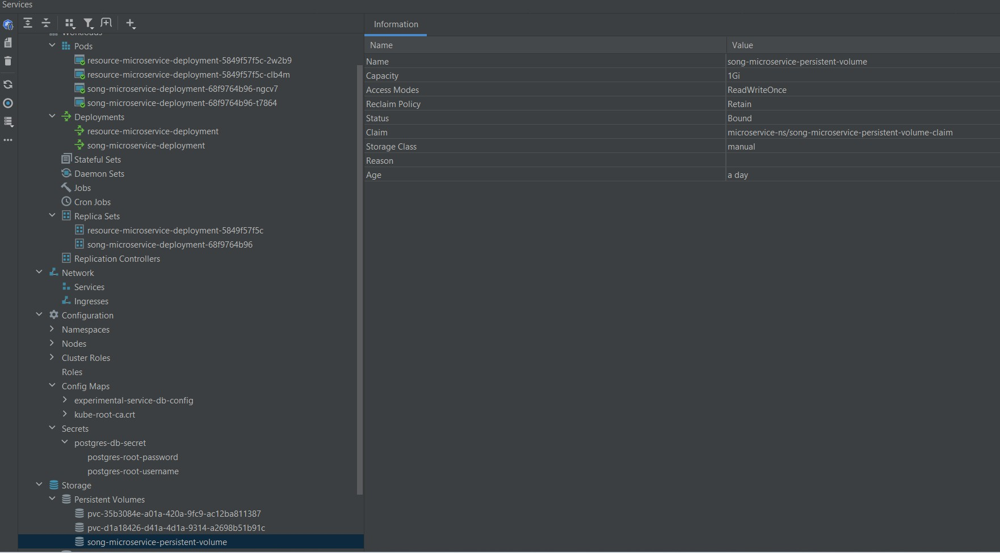.  

PersistentVolume contains ```/mnt/persistentVolume/microservice/song``` directories  
that contain file **testPersistedFile.txt**. The file contains a string  
**Hello from Kubernetes! This is a dedicated storage for song-microservice!**  
A Screenshot below demonstrates PersistentVolume contents.
*NB: in order to connect to the worker-node it is required to use ```rdctl shell``` command in the terminal*.  
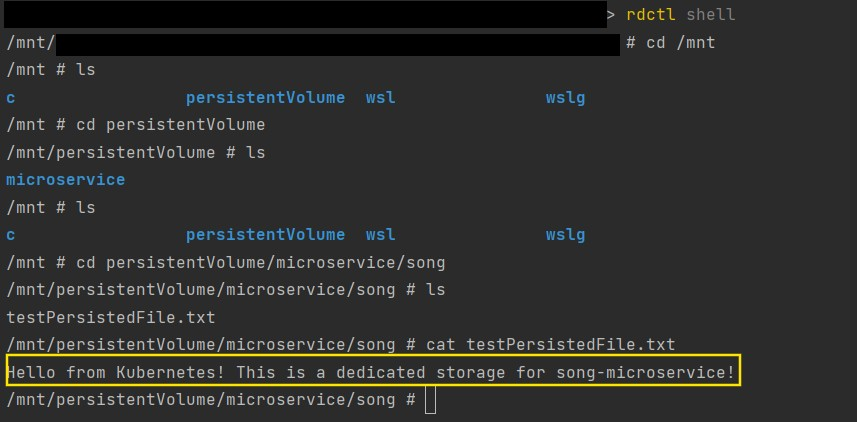  

In its turn, a screenshot below demonstrates the same file content on one of **song-microservice** Pods.
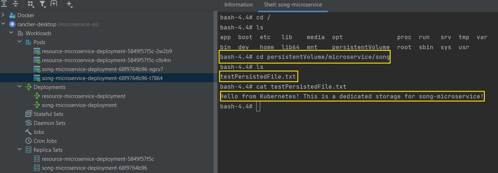.  

  4d. **Sub-task 4: Stateful Sets**.  
  The required k8s component deployment configuration located in the ```k8s/statefulset``` folder.  
  It contains following artefacts:
  - configuration of **Namespace**s for databases and microservices.
  - database **Deployment** configuration as a StatefulSet + respective **ConfigMap** and **Secret**,
  - microservice **Deployment** configuration as a Pod + respective **ConfigMap** and **Secret**,
  - configuration for **NodePort** services attached to respective microservices.
    Here **ConfigMap** and **Secret** are created per a **namespace**.
The deployment results are represented on the screenshots below:
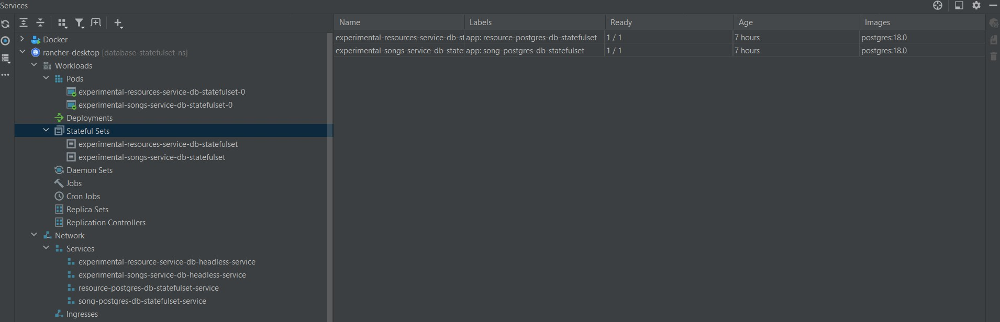  
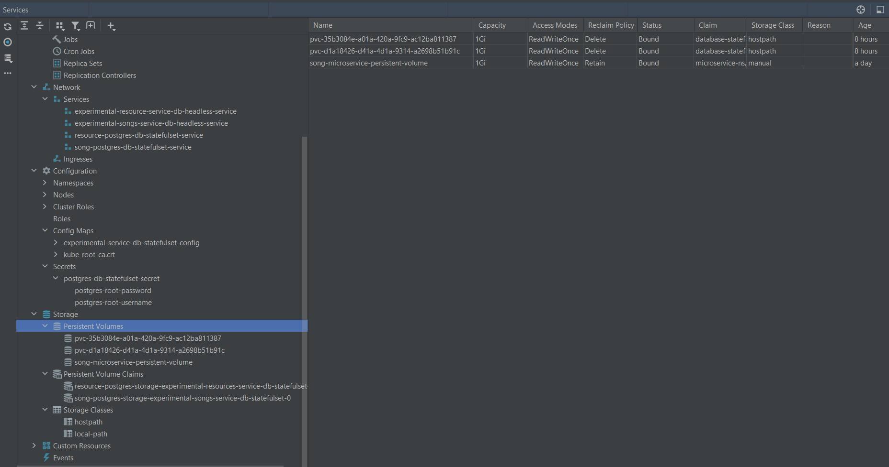  
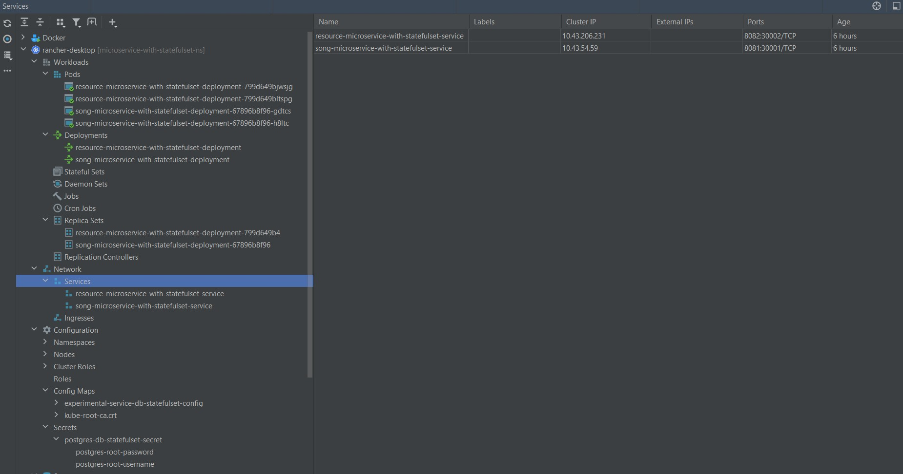  

Screenshots below demonstrate that deployed microservice configuration is functional:
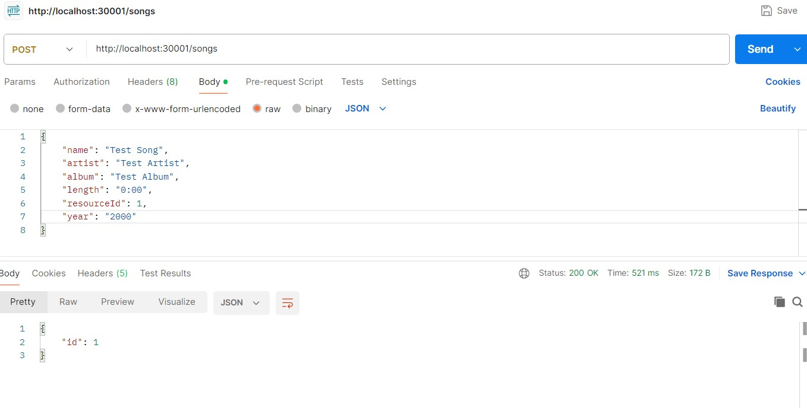  
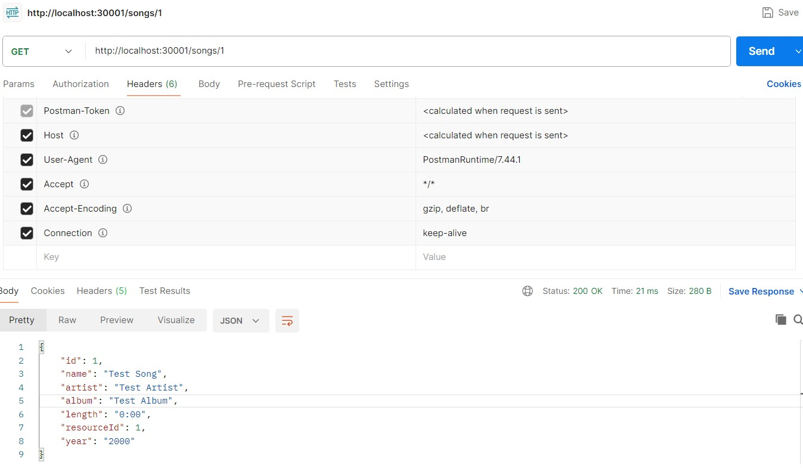  
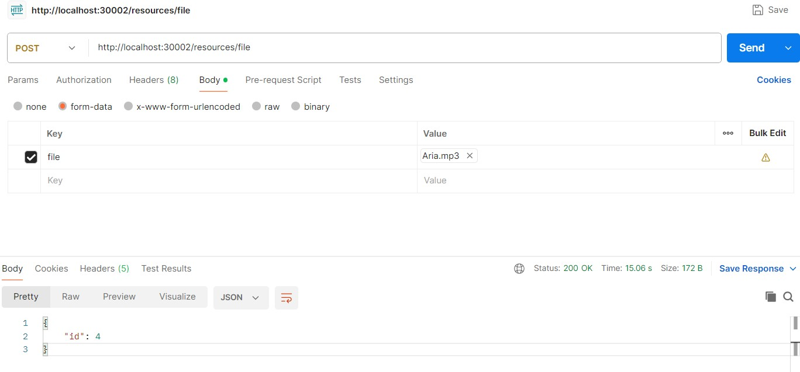  
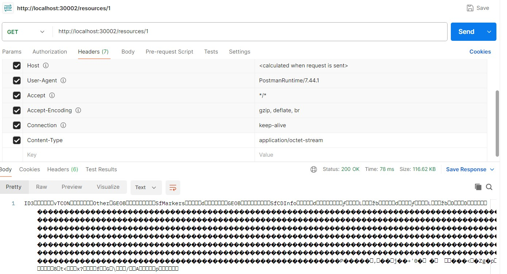  

### End Of Description

