# K8s basics
## Module 2: Deployment and Configuration in Kubernetes

### Pre-requisites:
#### 0. Install [Rancher Desktop](https://docs.rancherdesktop.io/).
#### 1. Build executable jar-files for all projects (gradle-modules):
- **eureka** - this service will not be needed for K8s experiments;
- **songs-service**;
- **resource-service**;

To do this, being in the project's root folder, run the command in the Terminal:
```
.\gradlew bootJar 
```
Locations of respective bootable jars:
- **eureka** - eureka/build/libs/eureka-1.0-SNAPSHOT.jar;
- **songs-service** - songs-service/build/libs/songs-service-1.0-SNAPSHOT.jar;
- **resource-service** - resource-service/build/libs/resources-service-1.0-SNAPSHOT.jar;

#### 3. Build Docker images from respective Dockerfiles:
- **songs-service** ```docker build -t experimentalmicroservice-1-songs-ms:1.0 .```
- **resource-service** ```docker build -t experimentalmicroservice-1-resources-ms:1.0 .```  
  *NB: The final ```.``` in the command provides the path or URL to the build context.  
  At this location, the builder will find the Dockerfile and other referenced files.*  
  Refer to:
  [Docker:build-tag-and-publish-an-image](https://docs.docker.com/get-started/docker-concepts/building-images/build-tag-and-publish-an-image/).

When docker-image is built, it is stored in the local image registry supplied by [Docker Moby](https://github.com/moby/moby),  
which is a part of [Rancher Desktop](https://docs.rancherdesktop.io/#container-management):  
Components include container build tools, a **container registry**, orchestration tools, a runtime, and more,  
and these can be used as building blocks in conjunction with other tools and projects.  
This is crucial because kubernetes requires docker-images for all components, it deploys in a cluster,  
that without **local image-registry** have to be pushed into the remote Docker Hub or another image-registry system, e.g. AWS ERC.


#### Small Title
#### 4. **K8s module 2 tasks**
##### 4a. **Sub-task 1: Secrets and config-maps**
    - Add Secrets object to your k8s manifest to store database username and password.
    - Add config maps to store environment variables for application deployments.
    - Add sql scripts to init databases (create tables) to config maps.
    - Change k8s Deployment and StatefulSet objects to load these secrets and config-maps.

Configuration of 2 required **song** and **resource** databases is given in the **./k8s/initdatabase/database** folder,
which contains respective ConfigMaps, Secrets, init-database scripts, and their utilization in respective StatefulSets
via the ```/docker-entrypoint-initdb.d``` directory in order to initialise related databases at the container initialisation
phase.

*!NB: If a PersistenceVolume is attached to a StatefulSet this initialisation works at the very first database-container run,
after that the db-scheme is taken from a PersistenceVolume and treated as already created, hence no init-script will be run.*

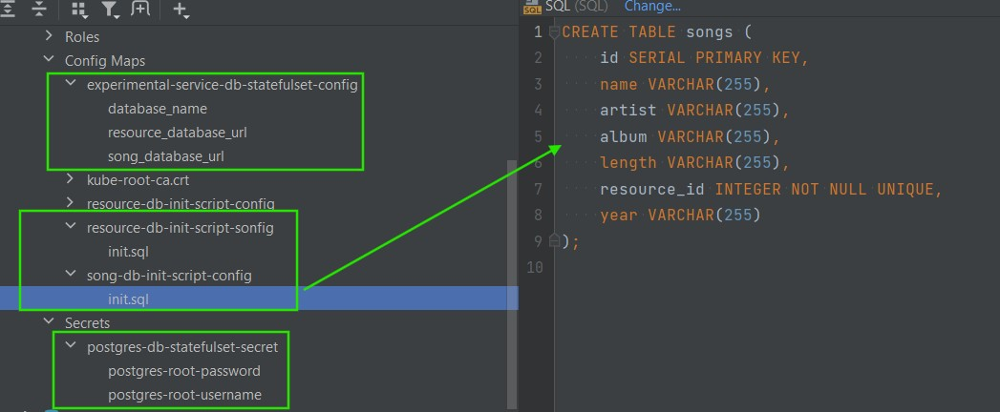

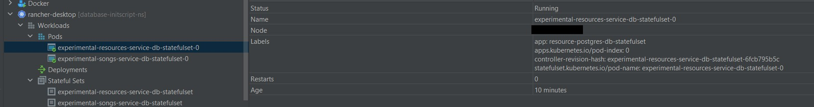

In order to verify a db-structure it is required to connect to the container's terminal, then to the pgsql tool:
```psql -U <user> -h <host> -d <database_name>```

According to the [Postgresql-Administration](https://neon.com/postgresql/postgresql-administration/postgresql-describe-table)
resource, some useful commands:\
``\dt`` - lists all tables within a scheme;\
``\ds`` - lists all sequences within a scheme;\
```\d <table_name>``` - describes table structure;\
```\l``` - lists all databases in the deployed RDBMS.

See screenshots below with such connection details to the **resource** and **song** databases, respectively.

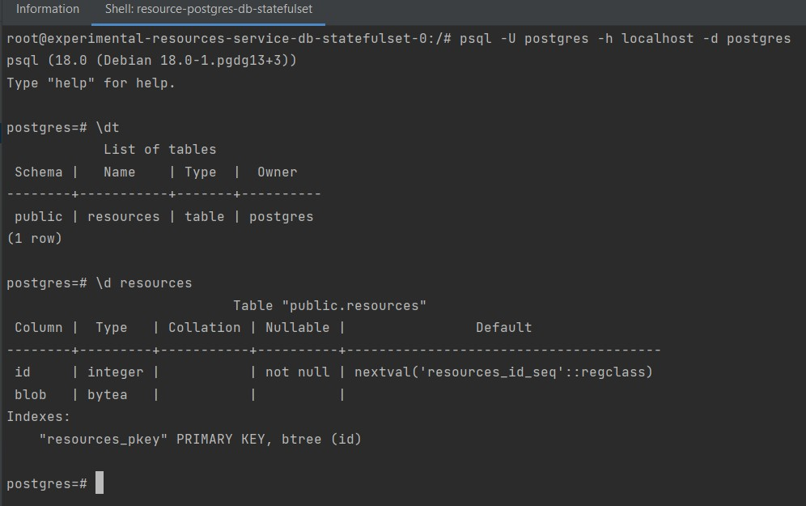

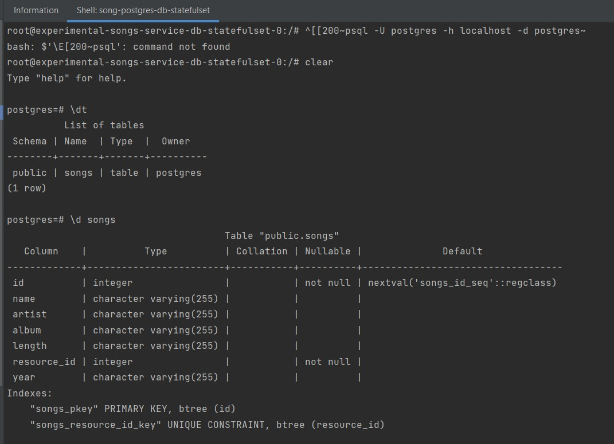

##### 4b. **Sub-task 2: Liveness and Readiness probes**
- Add endpoints for health checks to your applications.
  The **actuator** lib was added to the build.gradle
  ```implementation 'org.springframework.boot:spring-boot-starter-actuator'``` of respective microservices
  and configured for details see respective ```application.properties``` files:
```
management.endpoints.web.exposure.include=health,info,metrics

management.endpoint.health.probes.enabled=true
management.health.livenessstate.enabled=true
management.health.readinessstate.enabled=true
```
After that, respective Docker-images were re-built, see [p.3](#3.-build-docker-images-from-respective-dockerfiles:).

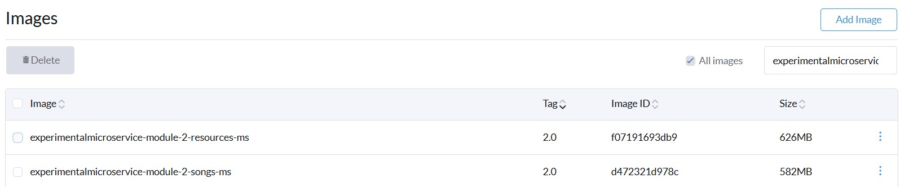

- Add startup, liveness, and readiness probes for your Deployment objects at k8s manifest.
  Respective configuration for databases and microservices located in the **./k8s/resinessprobe** folder.
  The configuration result can be found here:

[Song database readiness](screenshot/Module2_Task2_song_db_readiness_2.txt);\
[Song microservice readiness](screenshot/Module2_Task2_song_microservie_readiness_3.txt);

- Add startup, liveness, and readiness probes for your StatefulSet objects at k8s manifest.
  The configuration result can be found here:

[Resource database readiness](screenshot/Module2_Task2_resource_db_readiness_1.txt);\
[Resource microservice readiness](screenshot/Module2_Task2_resource_microservice_readiness_1.txt);

##### 4c. **Sub-task 3: Deployment strategies**
- To the Song service, add a new field genre (:String). Add corresponding logic so this field will represent the genre of a song. This field should also be returned in the responses for both POST and GET operations.
  Respective [SongData.java](songs-service/src/main/java/com/ms/intro/domain/SongData.java)
  and [SongDto](songs-service/src/main/java/com/ms/intro/dto/SongDto.java) files were modified accordingly.

- Build a new Docker image of the application with changes and push it to the Docker Hub (specify another version of the container).
  After that, respective Docker-images were re-built, see [p.3](#3.-build-docker-images-from-respective-dockerfiles:)

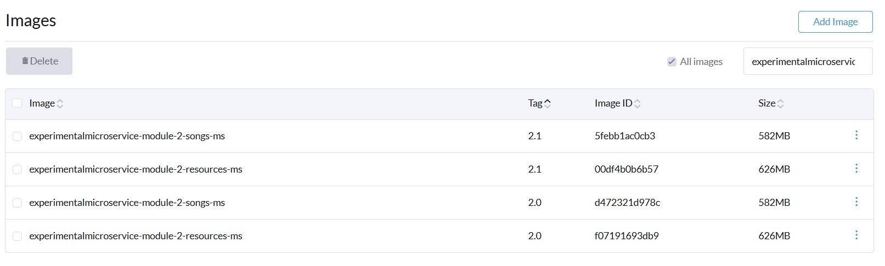

- Add Rolling-update deployment strategy to your deployments in manifest files and apply the  manifest, so the old versions of microservices are deployed and running.

Configuration of the **song** microservice is provided in the **./k8s/deploymentversioncontrol** folder.
Respective results are given in screenshots below:

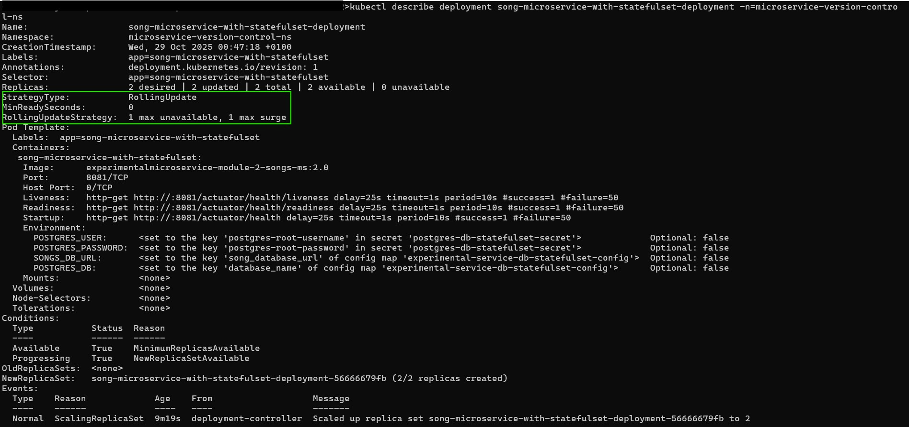

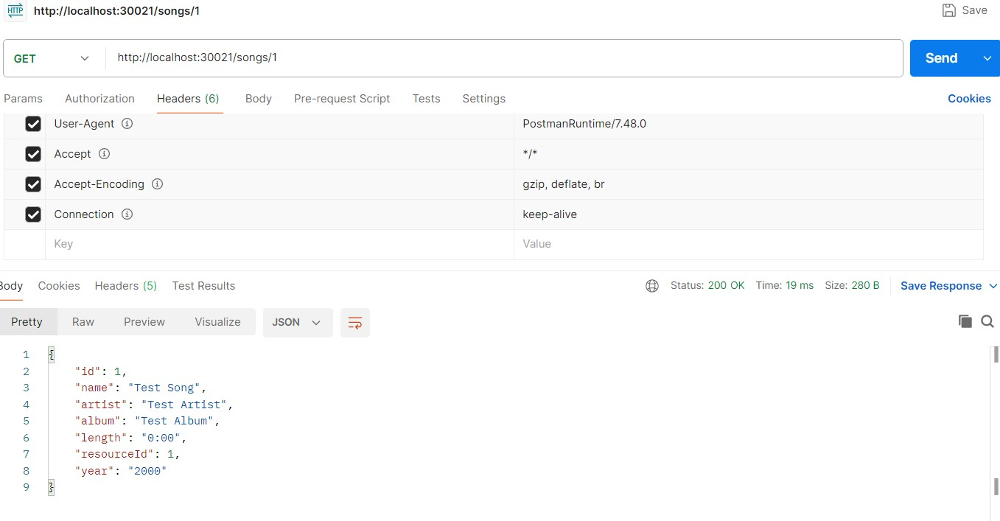

- Set the app version of the app containers to the new one and apply the manifest one more time. Make sure that new changes are deployed.
  Respective results are given in screenshots below:


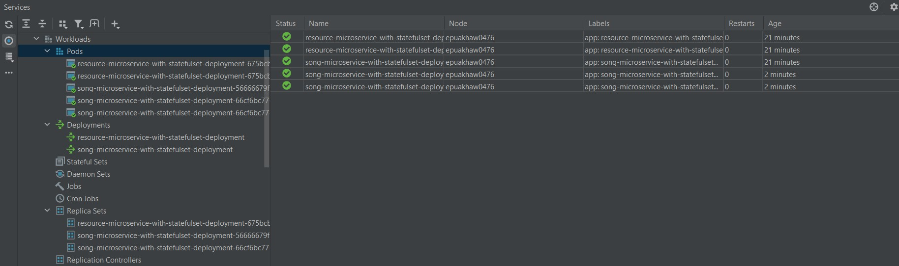

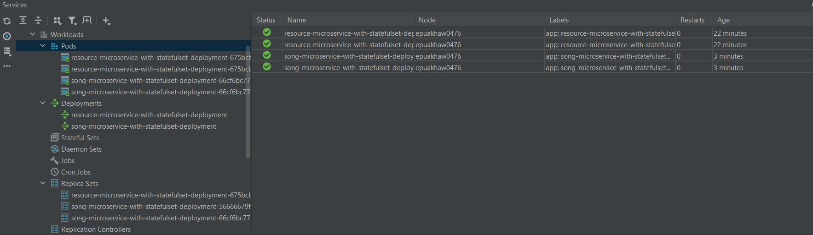

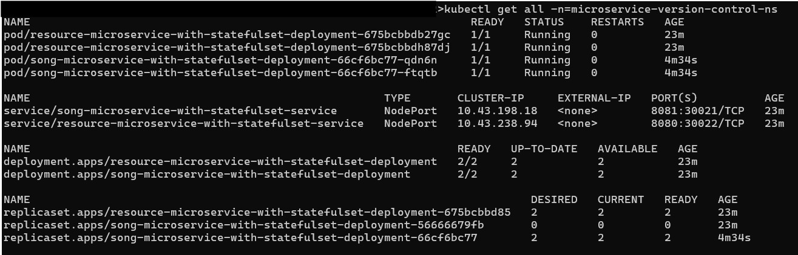

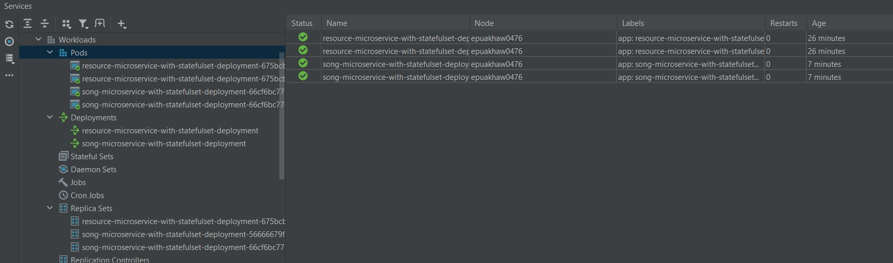

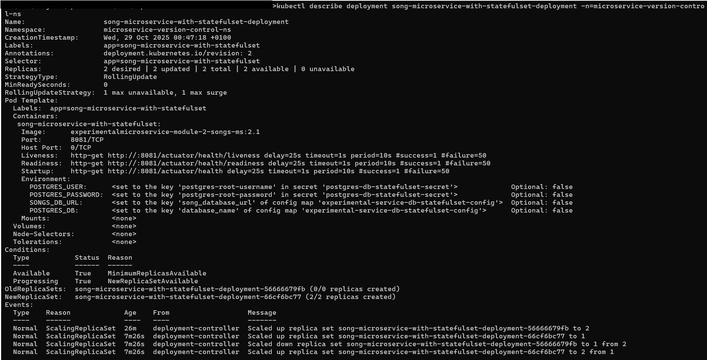

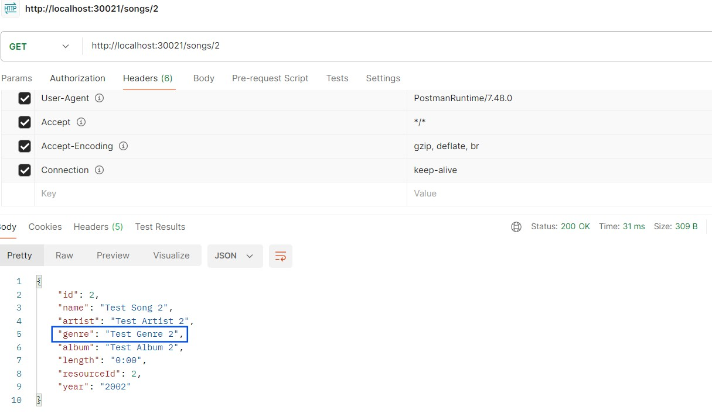

##### 4d. **Sub-task 4: Deployment history**
As you deploy a new version of your application, you can see the history of your deployments. Your task is to roll back to the previous version of your deployment without changing your manifest files.
Put in comments the solution to this task.

- The rollout history

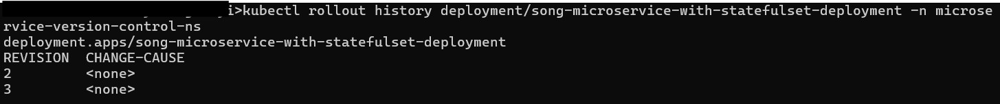

- The rollout process is given in the screenshot below:

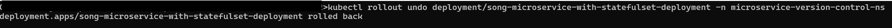

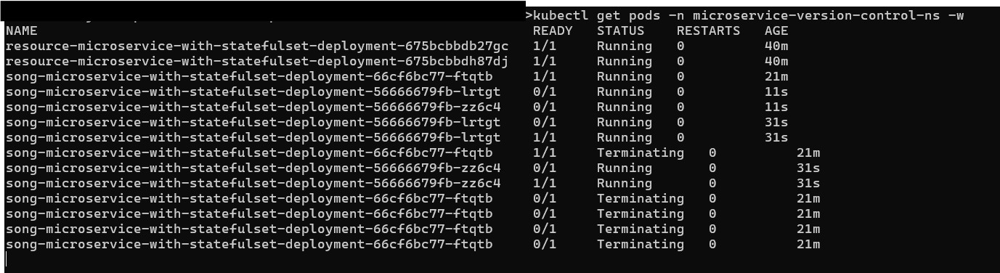

- The result of deployment rollback

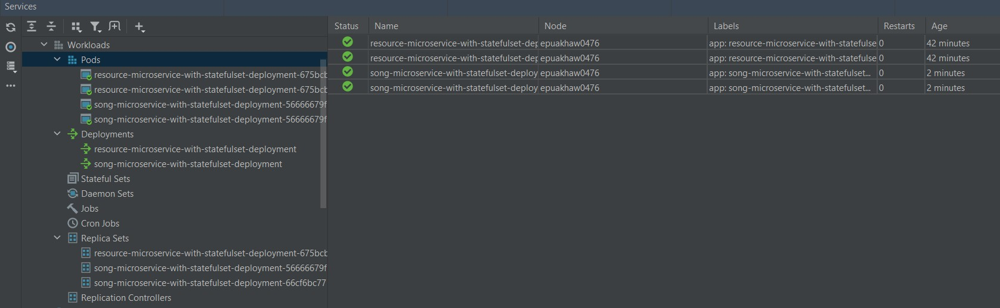

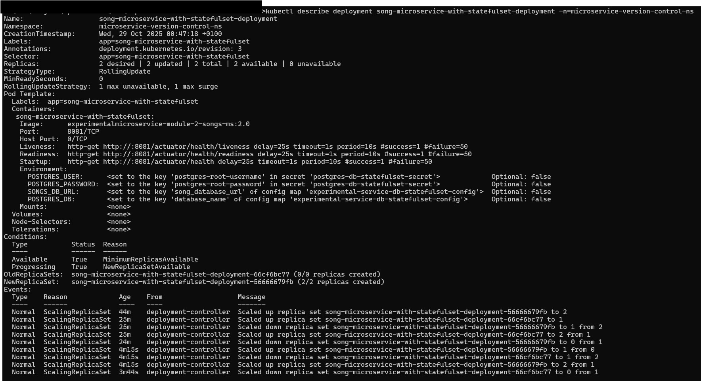

#### At this point, Module 2 could be considered as resolved.