# K8s basics
## Module 4: Network and Ingress in Kubernetes

### Pre-requisites:
#### 1. Install [Rancher Desktop](https://docs.rancherdesktop.io/).
#### 2. Build executable jar-files for all projects (gradle-modules):
- **eureka** - this service will not be needed for K8s experiments;
- **songs-service**;
- **resource-service**;

To do this, being in the project's root folder, run the command in the Terminal:
```
.\gradlew bootJar 
```
Locations of respective bootable jars:
- **eureka** - eureka/build/libs/eureka-1.0-SNAPSHOT.jar;
- **songs-service** - songs-service/build/libs/songs-service-1.0-SNAPSHOT.jar;
- **resource-service** - resource-service/build/libs/resources-service-1.0-SNAPSHOT.jar;

#### 3. Build Docker images from respective Dockerfiles:
- **songs-service** ```docker build -t experimentalmicroservice-1-songs-ms:1.0 .```
- **resource-service** ```docker build -t experimentalmicroservice-1-resources-ms:1.0 .```  
  *NB: The final ```.``` in the command provides the path or URL to the build context.  
  At this location, the builder will find the Dockerfile and other referenced files.*  
  Refer to:
  [Docker:build-tag-and-publish-an-image](https://docs.docker.com/get-started/docker-concepts/building-images/build-tag-and-publish-an-image/).

When docker-image is built, it is stored in the local image registry supplied by [Docker Moby](https://github.com/moby/moby),  
which is a part of [Rancher Desktop](https://docs.rancherdesktop.io/#container-management):  
Components include container build tools, a **container registry**, orchestration tools, a runtime, and more,  
and these can be used as building blocks in conjunction with other tools and projects.  
This is crucial because kubernetes requires docker-images for all components, it deploys in a cluster,  
that without **local image-registry** have to be pushed into the remote Docker Hub or another image-registry system, e.g. AWS ERC.


#### 4. **K8s module 4 "Ingress" tasks**
    - Install ingress controller using helm chart. (guide)
    - Change Services type to ClusterIP to restrict external access.
    - Create ingress resource and route your traffic using rules.
    - Configure rewrite-target of path using annotations. Example routing: from http://localhost:8080/api/v1/songs to http://songs:8080/api/v1.
([ref docs](https://kubernetes.github.io/ingress-nginx/examples/rewrite/#rewrite-target)).

1. Installation of NGINX ingress-controller designed by the Kubernetes developer-team. This version should be installed 
since in this implementation the nginx server has "path" regular expressions processing feature, 
which is required for this module's tasks:
  - [kubernetes/ingress-nginx](https://github.com/kubernetes/ingress-nginx?tab=readme-ov-file#get-started);
  - [installation guide](https://kubernetes.github.io/ingress-nginx/deploy/) --> **Quick start**
```
helm upgrade --install ingress-nginx ingress-nginx --repo https://kubernetes.github.io/ingress-nginx --namespace microservice-ingress-ns
```
*!NB: There is an alternative installation exists, made by the NGINEX-team for Kubernetes.
This version should NOT be installed since it doe not fit need of the module.
In this implementation NGINX has NO "path" regular expressions processing feature, required for the module tasks,
at least in the Nginex OSS (open source) version.
It might be present in the paid, enterprise-grade version Nginx Plus, but it is distributed from a private repository.  
[nginx/kubernetes-ingress](https://github.com/nginx/kubernetes-ingress/pkgs/container/charts%2Fnginx-ingress/540518280?tag=2.3.1);\
[install the Helm chart using the OCI Registry](https://docs.nginx.com/nginx-ingress-controller/installation/installing-nic/installation-with-helm/#install-the-helm-chart-using-the-oci-registry).\
NGINX Open Source: helm install my-release oci://ghcr.io/nginx/charts/nginx-ingress --version 2.3.1*

Since Rancher Desktop has already preinstalled an ingress-controller - [Traefik](https://doc.traefik.io/traefik/reference/install-configuration/providers/kubernetes/kubernetes-ingress/),
which is an open-source Application Proxy server, it is required to perform a bunch of
preparations:
  - Uncheck Enable Traefik from the Kubernetes Settings page to disable Traefik. 
You may need to exit and restart Rancher Desktop for the change to take effect.
  - Deploy the NGINX ingress controller via helm or kubectl.
For more details please refer to Rancher Desktop documentation, [Setup NGINX Ingress Controller](https://docs.rancherdesktop.io/how-to-guides/setup-NGINX-Ingress-Controller/).

The state of system pods before installation of **nginx ingress-controller**, see below.
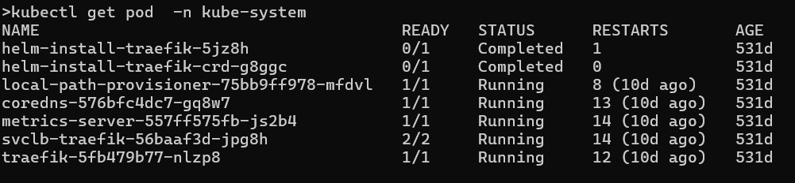

Actions, listed above, are required because already existent traefik ingress-controller **locks** ports ``80`` and ``443``,\
and nginx ingress-controller can not start its [load balancer](https://kubernetes.io/docs/concepts/services-networking/ingress/#what-is-ingress).

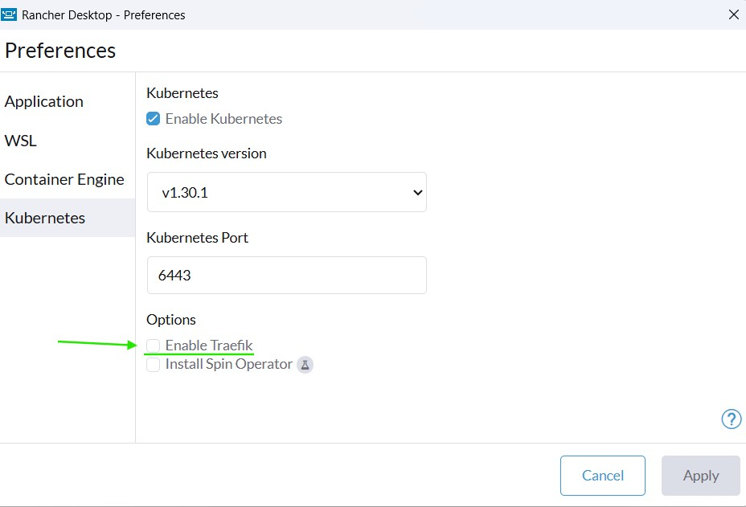

After that the helm-installation command has to be executed:

``` 
helm upgrade --install ingress-nginx ingress-nginx --repo https://kubernetes.github.io/ingress-nginx --namespace microservice-ingress-ns
```

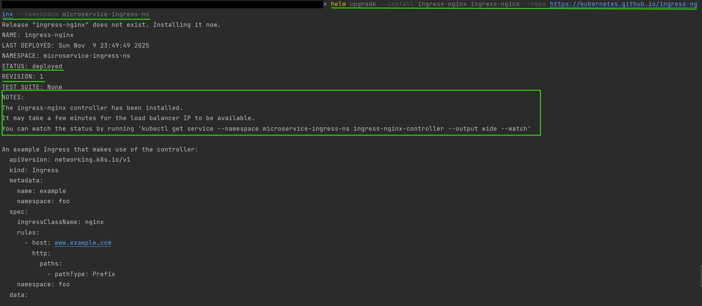
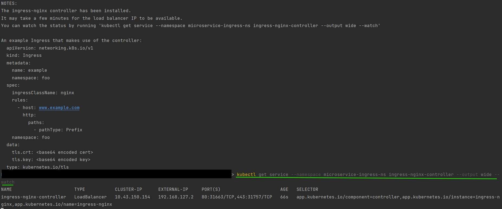

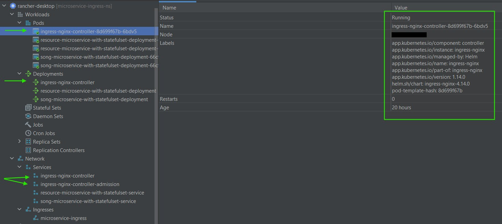

Command below shows deployment history of the **nginx ingress-controller**.
```
helm history ingress-nginx --namespace microservice-ingress-ns
```

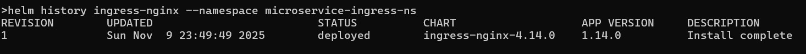

And deployed **IngressClass** ``nginx``.

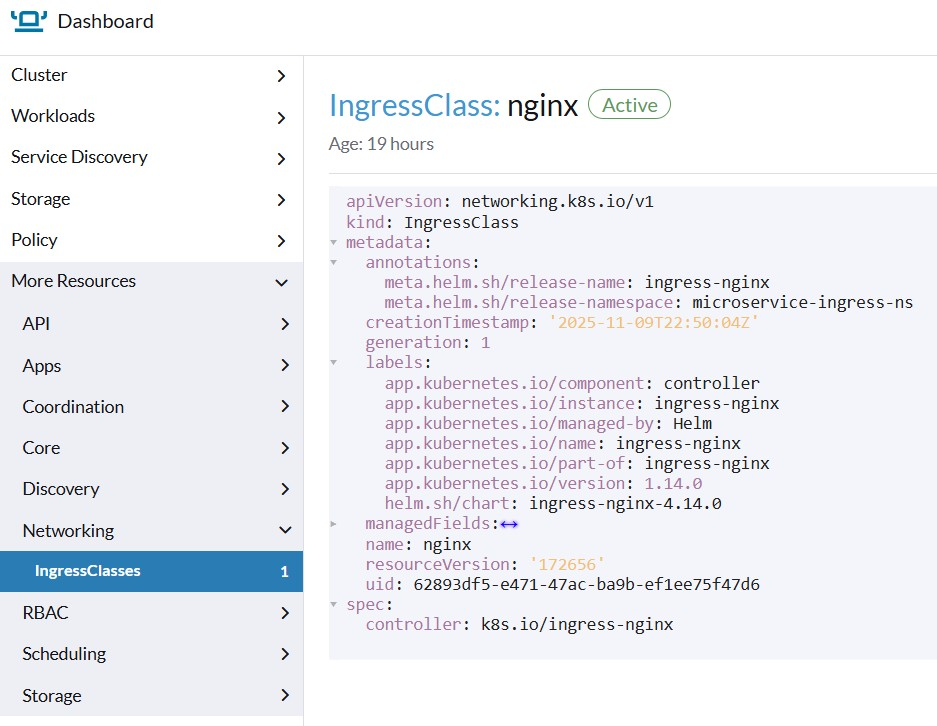

2. Both microservices and ingress are implemented as a helm-chart.\
Each microservice is implemented as a separate very basic helm-template that use default [values](k8s/ingress/charts/microservice-chart/values.yaml).\
Service alterations for **song** and **resource** microservices are configured in 
[k8s-song-microservice-deployment.yaml](k8s/ingress/charts/microservice-chart/templates/microservice/song/k8s-song-microservice-deployment.yaml)
and [k8s-audio-resource-microservice-deployment.yaml](k8s/ingress/charts/microservice-chart/templates/microservice/audioresorce/k8s-audio-resource-microservice-deployment.yaml) 
respectively.

3. In order perform allow an outer access cluster and request routing a respective microservice, an [ingress](https://kubernetes.io/docs/concepts/services-networking/ingress/)
resource and traffic routing was configured, please refer to [ingress.yaml](k8s/ingress/charts/microservice-chart/templates/microservice/ingress/ingress.yaml).

4. The uri rewrite is achieved with ``rewrite-targe`` and ``use-regex`` annotations of the [ingress](https://kubernetes.io/docs/concepts/services-networking/ingress/).\
See [rewrite-target](https://github.com/kubernetes/ingress-nginx/tree/main/docs/examples/rewrite) for more details regarding regular expressions and their groups.
```
kind: Ingress
metadata:
  name: {{ .Values.ingress.name }}
  namespace: {{ .Values.namespace }}
  annotations:
    nginx.ingress.kubernetes.io/rewrite-target: /$2
    nginx.ingress.kubernetes.io/use-regex: "true"
...

          - path: /song/api/v1(/|$)(.*) 
```

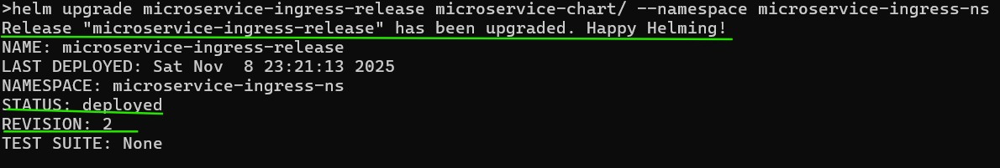

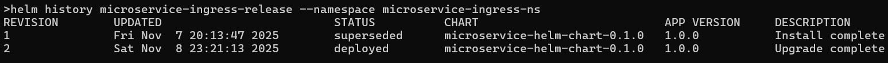

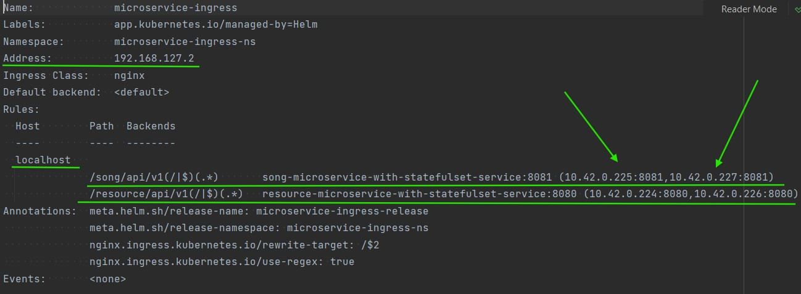

Actually the results of **ingress** ``target-rewrite``
  - song microservice **POST** song insertion

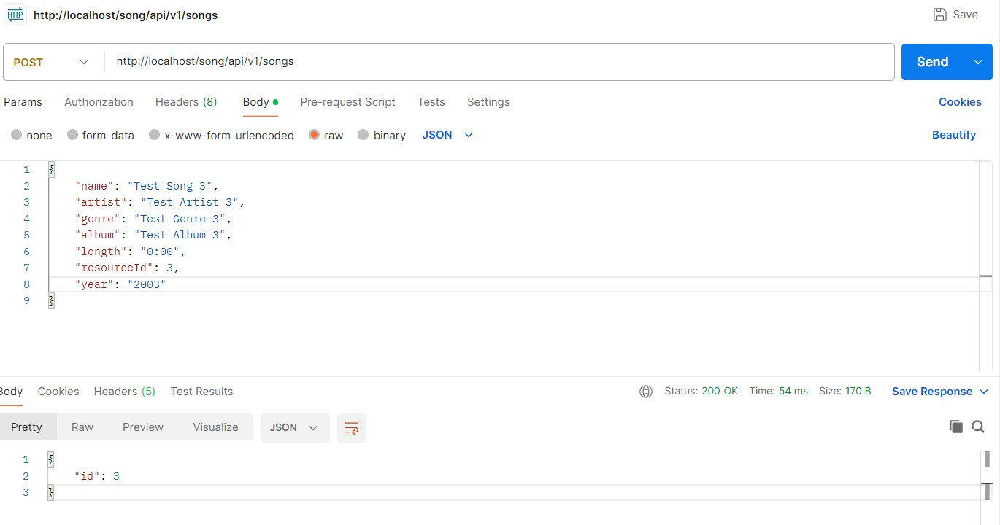

  - song microservice **GET** song selection

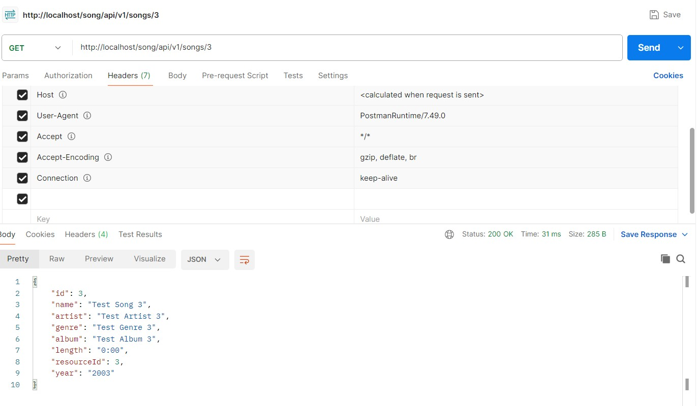

  - resource microservice **POST** audio-file insertion

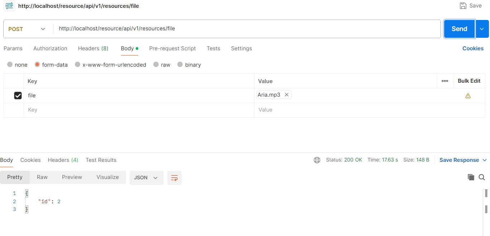

  - resource microservice **GET** audio-file selection

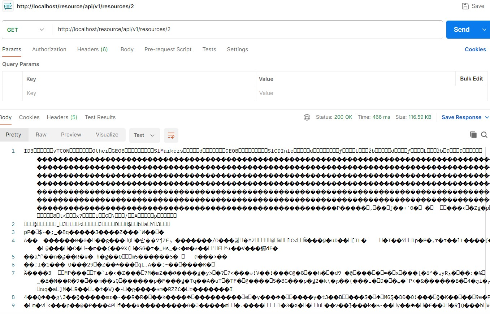

#### WORK IN PROGRESS...

#### At this point, Module 4 could be considered as resolved.