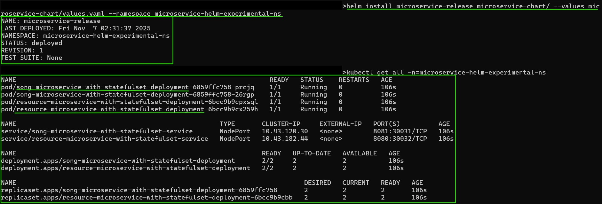
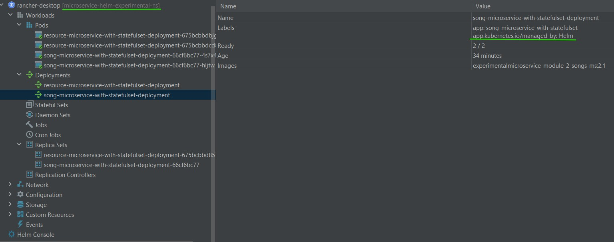
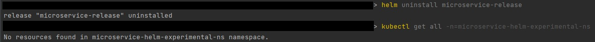
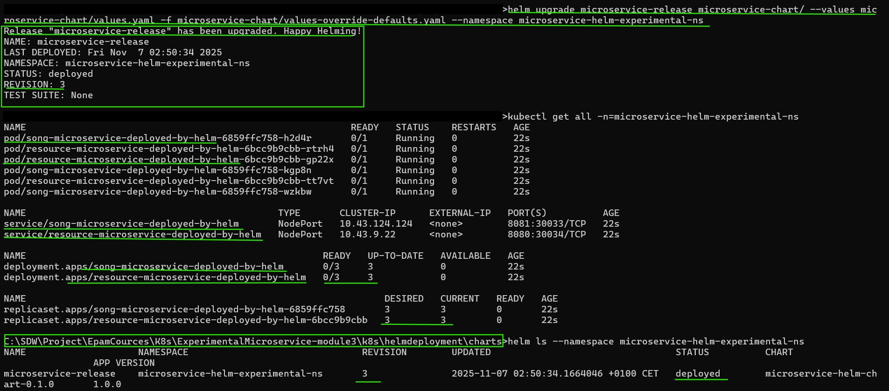
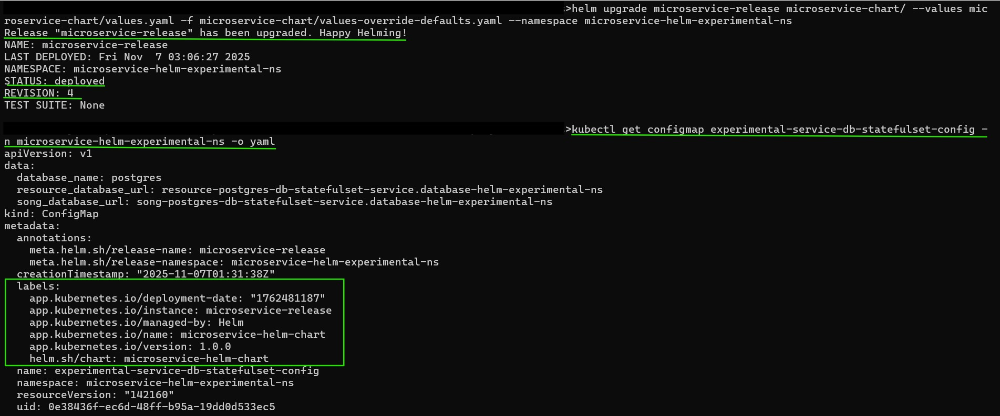

# K8s basics
## Module 2: Deployment and Configuration in Kubernetes

### Pre-requisites:
#### 0. Install [Rancher Desktop](https://docs.rancherdesktop.io/).
#### 1. Build executable jar-files for all projects (gradle-modules):
- **eureka** - this service will not be needed for K8s experiments;
- **songs-service**;
- **resource-service**;

To do this, being in the project's root folder, run the command in the Terminal:
```
.\gradlew bootJar 
```
Locations of respective bootable jars:
- **eureka** - eureka/build/libs/eureka-1.0-SNAPSHOT.jar;
- **songs-service** - songs-service/build/libs/songs-service-1.0-SNAPSHOT.jar;
- **resource-service** - resource-service/build/libs/resources-service-1.0-SNAPSHOT.jar;

#### 3. Build Docker images from respective Dockerfiles:
- **songs-service** ```docker build -t experimentalmicroservice-1-songs-ms:1.0 .```
- **resource-service** ```docker build -t experimentalmicroservice-1-resources-ms:1.0 .```  
  *NB: The final ```.``` in the command provides the path or URL to the build context.  
  At this location, the builder will find the Dockerfile and other referenced files.*  
  Refer to:
  [Docker:build-tag-and-publish-an-image](https://docs.docker.com/get-started/docker-concepts/building-images/build-tag-and-publish-an-image/).

When docker-image is built, it is stored in the local image registry supplied by [Docker Moby](https://github.com/moby/moby),  
which is a part of [Rancher Desktop](https://docs.rancherdesktop.io/#container-management):  
Components include container build tools, a **container registry**, orchestration tools, a runtime, and more,  
and these can be used as building blocks in conjunction with other tools and projects.  
This is crucial because kubernetes requires docker-images for all components, it deploys in a cluster,  
that without **local image-registry** have to be pushed into the remote Docker Hub or another image-registry system, e.g. AWS ERC.


#### 4. **K8s module 2 tasks**
##### 4a. **Sub-task 1: Helm chart default variables**
    - Install helm Official download link.
    - Add helm chart to deploy your applications. Make replica-count and namespace a helm values.
    - Add helm values file to store default values for helm variables.
    - Run helm using helm install command to deploy applications with default helm variables. Make sure, your applications are up and running.
    - Run helm once again, but this time set namespace and replica-count for helm intall to non-default values.    

*!NB: Helm-tool installation result is obvious because of other tasks are solved.

Configuration of 2 required **song** and **resource** databases resides in the **./k8s/helmdeployment/database** folder,
which contains respective ConfigMaps, Secrets, init-database scripts, and their utilization in respective StatefulSets
via the ```/docker-entrypoint-initdb.d``` directory in order to initialise related databases at the container initialisation
phase.

A helm-based configuration of **song** and **resource** microservices with all required templates and resources, 
aka values, resides in the **./k8s/helmdeployment/charts** folder, where:
- [Chart.yaml](k8s/helmdeployment/charts/microservice-chart/Chart.yaml) - is the basic helm-chart configuration, according to [chart package structure](https://helm.sh/docs/topics/charts#the-chart-file-structure);
- [values.yaml](k8s/helmdeployment/charts/microservice-chart/values.yaml) - default value-set for helm-templates;
- [values-override-defaults.yaml](k8s/helmdeployment/charts/microservice-chart/values-override-defaults.yaml) - values that override default value-set;
- [_helpers.tpl](k8s/helmdeployment/charts/microservice-chart/templates/microservice/configuration/_helpers.tpl) - named helm sub-template.

Helm deployment commands and respective figures with deployment results are given below.

1. Initial helm-chart deployment, the **REVISION 1**, of already existent microservice configuration without templating, see Fig. 1.

*!NB: Here and below it is not strictly needed to include "--namespace microservice-helm-experimental-ns" part
to the command, because it is set up in the configuration itself. Here it is included for 
the naming consistency of the console output, otherwise it will print "NAMESPACE: default"".*

```helm install microservice-release microservice-chart/ --namespace microservice-helm-experimental-ns```

```kubectl get all -n=microservice-helm-experimental-ns ```





2. Uninstall microservice-configuration, deployed at the step 1, because ```app``` selectors are immutable, 
hence, it is not possible to alter them at already deployed configuration 
(this is provided by Helm for linking-consistency reasons).

```helm uninstall microservice-release --namespace microservice-helm-experimental-ns```



3. Install helm template-based microservice configuration with default values.

```helm install microservice-release microservice-chart/ --values microservice-chart/values.yaml --namespace microservice-helm-experimental-ns```

Here the result is similar to the step 1.

4. Upgrade helm-release, the **REVISION 3**, with overriden variable-set: **serviceName**, **podName**, **replicaCount**.
For details please refer to [values-override-defaults.yaml](k8s/helmdeployment/charts/microservice-chart/values-override-defaults.yaml)

```helm upgrade microservice-release microservice-chart/ --values microservice-chart/values.yaml -f microservice-chart/values-override-defaults.yaml --namespace microservice-helm-experimental-ns```



##### 4b. **Sub-task 2:  Helm chart helpers**

    - Create helm _helpers.tpl file and define next labels there:
        * current date : use helm generator for it's value;
        * version;
    - Make a config-map use values as labels from helm _helpers.tpl file.

5. Upgrade microservice [configmap](k8s/helmdeployment/charts/microservice-chart/templates/microservice/configuration/k8s-experimental-service-with-statefulset-config.yaml), 
the **REVISION 4**, with **metadata labels** described in the [_helpers.tpl](k8s/helmdeployment/charts/microservice-chart/templates/microservice/configuration/_helpers.tpl)
named sub-template.

```helm install microservice-release microservice-chart/ --values microservice-chart/values.yaml --namespace microservice-helm-experimental-ns```



#### At this point, Module 3 could be considered as resolved.